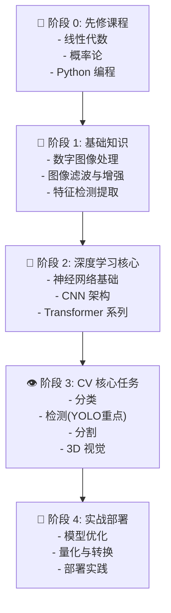

# 机器视觉学习路线图

## 📊 学习阶段概览

## 📚 详细学习路径

### ⏳ 第一阶段：先修基础（4周）

#### [[Math_for_CV|数学基础]]
- [[Math_for_CV/线性代数|线性代数（特征向量、矩阵分解）]]
- [[Math_for_CV/概率论|概率论与统计（分布、贝叶斯）]]
- [[Math_for_CV/最优化|最优化理论（梯度下降、凸优化）]]

### 📖 第二阶段：图像处理基础（6周）

#### [[Digital_Image_Processing|数字图像处理]]
1. **[[Image_Representation_&_Color_Spaces|图像表示与颜色空间]]**
   - RGB、HSV、YUV 颜色模型
   - 图像采样、量化、编码
   - Bayer 阵列与 Demosaicing

2. **[[Pixel_Operations_&_Transformation|像素操作与几何变换]]**
   - 图像配准、缩放、旋转
   - 透视变换与仿射变换
   - 双线性插值与高阶插值

3. **[[Image_Filtering_&_Enhancement|滤波与图像增强]]**
   - [[Image_Filtering_&_Enhancement/Linear Filters|线性滤波（高斯、拉普拉斯、Sobel）]]
   - [[Image_Filtering_&_Enhancement/Kernel and Filter|卷积核设计与滤波原理]]
   - 非线性滤波（中值滤波、双边滤波）
   - 直方图均衡化、CLAHE

4. **[[Edge_Detection_&_Features|边缘检测与特征提取]]**
   - Canny、Sobel、Laplacian 边缘检测
   - Harris 角点检测
   - SIFT、SURF、ORB 特征描述符
   - 特征匹配与跟踪

### 🧠 第三阶段：机器学习基础（4周）

#### [[Machine_Learning_Basic|机器学习基础]]
- **监督学习**：SVM、线性回归、逻辑回归
- **无监督学习**：K-Means、层次聚类、DBSCAN
- **集成方法**：随机森林、梯度提升
- **模型评估**：交叉验证、混淆矩阵、ROC 曲线

### 🔴 第四阶段：深度学习核心（8周）

#### [[Architectures|深度神经网络架构]]

**CNN 系列**：
- [[Architectures/CNN_Series|经典 CNN 架构]]
  - LeNet、AlexNet、VGG
  - [[Image_Filtering_&_Enhancement/MobileNet|MobileNet]]（轻量级架构）
  - [[Architectures/CNN_Series|ResNet（跳跃连接）]]
  - EfficientNet（神经架构搜索）
  - DenseNet、MobileNetV3/V4

**Transformer 系列**：
- [[Architectures/Transformer_Series|Vision Transformer]]（ViT 基础）
- [[Architectures/Transformer_Series|Swin Transformer]]（分层结构）
- [[Architectures/Transformer_Series|MAE]]（掩码自动编码）
- DeiT、CvT、T2T-ViT

**其他架构**：
- [[Architectures/MLP_&_Others|纯 MLP 架构（MLP-Mixer、RepMLP）]]
- 混合架构（CNN + Transformer）

#### [[Training_Techniques|训练技术]]
- **[[Training_Techniques/数据增强|数据增强]]**：Cutout、Mixup、RandAugment、AutoAugment
- **[[Training_Techniques/优化器|优化器]]**：SGD、Adam、AdamW、LAMB
- **[[Training_Techniques/正则化|正则化]]**：Dropout、权重衰减、标签平滑
- **[[Training_Techniques/损失函数|损失函数]]**：CrossEntropy、Focal Loss、Contrastive Loss

### 🎯 第五阶段：CV 核心任务（12周）

#### 1️⃣ **[[Classification|图像分类]]**（2周）
- ImageNet 数据集与预训练模型
- 微调（Fine-tuning）策略
- 类别不平衡处理

#### 2️⃣ **[[Object_Detection|目标检测]] - 🌟 重点**（6周）

**检测基础理论**：
- [[Object_Detection/YOLO 算法原理全深度解析 (Master Deep Dive)|YOLO 算法原理深度解析]]
- [[Object_Detection/Vision_Transformer_in_Object_Detection|Vision Transformer 在检测中的应用]]
- [[Object_Detection/CSPNet_Architecture|CSPNet 架构（跨阶段部分连接）]]

**YOLO 系列演进**：
- YOLOv1～v5：单阶段检测器的演进
- YOLOv6～v8：焦点损失与改进
- YOLOv9～v11：最新技术

**关键技术**：
- [[Object_Detection/YOLO_Loss_Functions|YOLO 损失函数设计]]
- [[Object_Detection/Data_Augmentation_Strategies|数据增强策略]]
- [[Object_Detection/Small_Object_Detection_Optimization|小目标检测优化]]
- [[Object_Detection/Kalman Filter|Kalman 滤波（目标跟踪）]]
- 非最大值抑制（NMS）与软-NMS

**其他检测器**：
- 两阶段检测器：RCNN 系列、Faster RCNN
- Anchor-free：CenterNet、FCOS、CornerNet
- 注意力机制在检测中的应用

#### 3️⃣ **[[Segmentation|图像分割]]**（3周）
- **语义分割**：FCN、U-Net、DeepLab 系列
- **实例分割**：Mask RCNN、YOLACT
- **全景分割**：Panoptic FPN
- 分割中的自监督学习

#### 4️⃣ **[[Generative_Models|生成模型]]**（2周）
- **GAN 系列**：基础 GAN、WGAN、StyleGAN、Progressive GAN
- **Diffusion Models**：DDPM、Stable Diffusion、ControlNet
- **VAE**：变分自编码器与图像生成

#### 5️⃣ **[[3D_Vision|3D 视觉]]**（3周）

**3D 几何基础**：
- [[3D_Vision/3D_Geometry_Foundations/Camera Models|相机模型与内参外参]]
- [[3D_Vision/3D_Geometry_Foundations/Camera Calibration|相机标定]]
- [[3D_Vision/3D_Geometry_Foundations/Coordinate Transformations|坐标变换]]
- [[3D_Vision/3D_Geometry_Foundations/Epipolar Geometry|对极几何与立体视觉]]

**3D 深度学习**：
- [[3D_Vision/3D_Deep_Learning_Architectures|3D CNN、3D 卷积与点云处理]]
- PointNet、PointNet++
- [[3D_Vision/3D_Representations|3D 表示方法：体素、点云、网格、隐函数]]

**神经渲染**：
- [[3D_Vision/Neural_Rendering_&_Reconstruction|NeRF（神经辐射场）]]
- 3D 高斯溅射（3DGS）
- 神经体积渲染

### 🚀 第六阶段：实战与部署（6周）

#### **项目实战**
- [[Competition_Kaggle|Kaggle 竞赛]]：经典项目案例
- [[Open_Source_Labs|开源项目研究]]：研究业界方案

#### **模型优化与部署**
- [[Deployment|部署框架]]
  - ONNX 转换与优化
  - TensorRT 量化与加速
  - 移动端部署（TensorFlow Lite、CoreML）
  - 量化（INT8、二值网络）
  - 知识蒸馏与模型压缩

### 📰 持续学习
- [[2024_Readings|2024 年论文精读]]
- [[2025_Readings|2025 年论文精读]]

---

## 🎓 学习建议

### 时间投入
| 阶段 | 预计时间 | 强度 |
|------|--------|------|
| 先修基础 | 4 周 | ⭐⭐⭐ |
| 图像处理 | 6 周 | ⭐⭐⭐⭐ |
| 机器学习 | 4 周 | ⭐⭐⭐ |
| 深度学习 | 8 周 | ⭐⭐⭐⭐⭐ |
| CV 任务 | 12 周 | ⭐⭐⭐⭐⭐ |
| 实战部署 | 6 周 | ⭐⭐⭐⭐ |

### 关键里程碑
- ✅ 第 4 周：掌握图像处理基础
- ✅ 第 10 周：理解 CNN 原理
- ✅ 第 20 周：复现 YOLO 检测器
- ✅ 第 28 周：完成完整项目
- ✅ 第 34 周：模型优化与部署能力

### 最佳实践
1. **不要跳步**：数学和图像处理是基础
2. **边学边实践**：每周完成小项目
3. **深入经典**：从 YOLO 开始深入研究
4. **阅读论文**：理论与代码并行
5. **复现项目**：自己实现每个算法

---

## 🔗 快速导航

| 领域 | 入口 | 重点 |
|------|------|------|
| 🔧 基础 | [[01_Foundations (底层基石)]] | 图像处理 + 数学 |
| 🧠 深度学习 | [[02_Deep_Learning_Core (神经网络核心)]] | CNN + Transformer |
| 👁️ CV 任务 | [[03_Computer_Vision_Tasks (核心任务)]] | 🌟 YOLO 检测 |
| 📚 论文 | [[04_Papers_&_Literature (论文精读)]] | 最新进展 |
| 💻 项目 | [[05_Projects_&_Code (项目实战)]] | 实战能力 |

---

> **学习哲学**：不仅要知道是什么（What），更要理解为什么（Why）和怎样做（How）。从数学原理出发，通过代码实现，最后通过项目验证。
